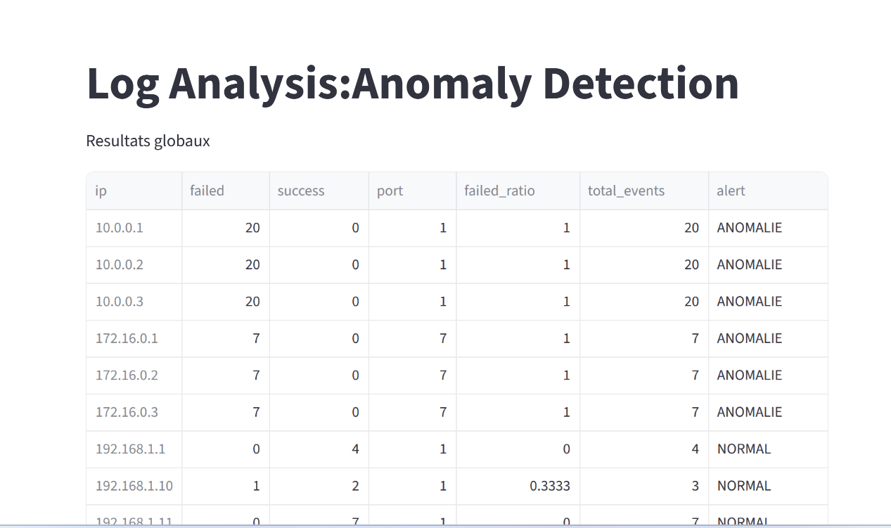

# Détection d'anomalies dans des logs de sécurité avec l'IA

## Objectif

Ce projet reproduit une partie du travail d'un analyste sécurité : repérer automatiquement des comportements anormaux dans des logs, comme des attaques par force brute ou des scans de ports, sans écrire de règles de détection à l'avance.

## Démarche

1. **Traitement des logs** avec pandas
2. **Création de variables** : nombre de tentatives de connexion échouées, ratios d'échec, ports utilisés
3. **Détection d'anomalies** avec Isolation Forest, un algorithme d'apprentissage non supervisé : il apprend le comportement normal et isole les activités atypiques, sans nécessiter de données étiquetées
4. **Visualisation** des résultats dans un tableau de bord interactif Streamlit

## Aperçu



## Technologies

Python · pandas · scikit-learn · Streamlit

## Lancer le projet

```bash
git clone https://github.com/KevineInes/AI-log-analysis-anomaly-detection.git
cd AI-log-analysis-anomaly-detection
pip install -r requirements.txt
python -m streamlit run app/app.py
```

## Limites et pistes d'amélioration

- Améliorer le réglage et l'évaluation du modèle
- Ajouter des graphiques d'analyse des anomalies détectées
- Traiter les logs en temps réel
- Combiner détection par règles et machine learning

## English summary

AI-based anomaly detection on security logs: feature engineering with pandas, unsupervised detection with Isolation Forest (brute force attempts, port scans), and an interactive Streamlit dashboard.

## Auteure

Kevine Ines Nzenti · [LinkedIn](https://www.linkedin.com/in/kevine-ines-nzenti/)
